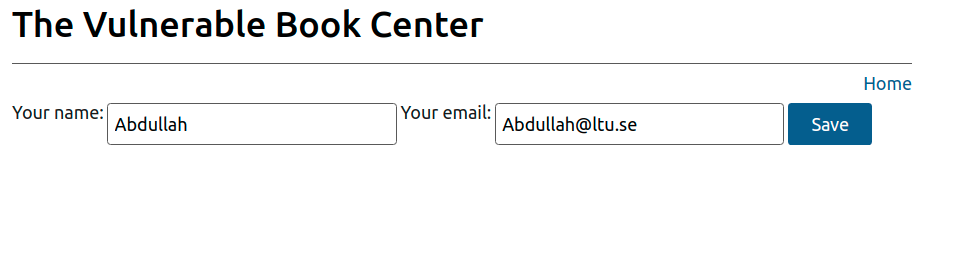

This repository is related to an assignment for self-study security course at EISLab in Lulea University of Technology. It contains a sample web application with Cross-Site Request Forgery (CSRF) vulnerabilities and its attacker website. The application is used to explain how CSRF attacks work.
<!-- [Prevent Cross-Site Request Forgery (CSRF) Attacks](https://auth0.com/blog/cross-site-request-forgery-csrf/) -->

---
### Technology

This project uses the following technologies:

-  [Node.js](https://nodejs.org/)

### What is CSRF?
A typical Cross-Site Request Forgery (CSRF or XSRF) attack aims to perform an operation in a web application on behalf of a user without their explicit consent. In general, it doesn't directly steal the user's identity, but it exploits the user to carry out an action without their will. For example, it can lead the user to change their email address or password in their profile or even perform a money transfer.


### CSRF in Action

To run this project, follow these steps:

1. Clone this repository

2. Move to the root folder of the project (`csrf-demo-app`) in your machine and install the dependencies by running the following command:

   ```shell
   npm install
   ```

3. To launch the web application, run the following command:

   ```shell
   npm start
   ```

4. Point your browser to [http://localhost:3000](http://localhost:3000) to access the sample web app. It will look like this: 


   The sample project implements a page of a book website. Only registered users can add their review to the book by filling in the text box and clicking the submit button. In fact, if you try to add a comment right now, nothing happens.

   For simplicity, the project doesn't implement an actual authentication process, since our focus is more on the issues that happen after a user is authenticated and gets a valid session. By clicking the `valid session link` within the message right above the submit button, you get a simulated user session. With that simulated session, the page should look like the following:
   

   As you can see, the warning message disappeared, and a new link Your profile appeared near the top right corner of the page. By clicking that new link, you can manage your profile, which for simplicity, consists of a name and an email address:
   

5. To launch the attacker website, run the following command:

   ```shell
   node attacker-server.js
   ```

6. Point your browser to [http://localhost:4000](http://localhost:4000/) to access the attacker website. You should see a page like the following:

This is a simple web page with a link that invites you to visit a website.
   > **_NOTE:_**  The attack shown here is based on the user visiting the attacker's website. However, the attack may happen in different ways: via email, instant messaging, social networks, etc.

   If you click the link, you are redirected to the user's profile page on the book website. But this is not the only navigation effect. The user's data has been replaced with the attacker's data:
   
You triggered this change by simply clicking the link on the attacker's website. How could this happen?

### The CSRF mechanics
Before analyzing the attacker's website to understand what happened, let's take a look at the user's profile page. It is a standard HTML form that allows you to change the user's name and email address. You can look at its code by opening the EJS template implemented in the `template/user.ejs` file. Its relevant content is as follows:
```html
<form method="post" action="user">
   <fieldset>
      <label for="username">Your name:</label>
      <input name="username" type="text" value="<%= username %>" class="thin">

      <label for="email">Your email:</label>
      <input name="email" type="email" value="<%= email %>" class="thin">

      <button type="submit" class="thin">Save</button></form>
   </fieldset>
</form>
```
The `/user` endpoint processing the form submission is implemented in the `server.js` file. This snippet highlights the relevant code:
```javascript
app.post('/user', function (req, res) {
  if (req.session.isValid) {
    req.session.username = req.body.username;
    req.session.email = req.body.email;
    res.redirect('/user');
  } else {
    res.redirect('/');
  }
});
```
The submitted data are accepted by the server only if a valid active session is present.

Now, let's see how this seemingly innocent link on the attacker's page is implemented. Its markup looks like the following:
```html
<form method="post" action="http://localhost:3000/user">
   <input type="hidden" name="username" value="The Attacker">
   <input type="hidden" name="email" value="theattacker@attacker.com">
</form>
<a href="#" onclick="document.forms[0].submit()">Visit this website!</a>
```
You notice a form with hidden fields. That form's action points to the user's profile page and the link triggers a simple JavaScript statement that submits the form.

This form is harmless when the user of the book website has no active session. The vulnerable website will refuse to change the user's profile because of this missing session. However, if the user has an active session, the change will be applied as any regular legitimate request.

This behavior is due to a cookie on the user's browser that tracks the current session on the book website. When the vulnerable website receives the change request, it appears legitimate since it has the correct session cookie.

So, even if the attacker has no direct access to the vulnerable website, they exploit the user and the CSRF vulnerability to perform unauthorized actions. In fact, unlike what may happen in XSS attacks, here, the attacker doesn't directly read the cookie and steal it.

> **_NOTE:_** "CSRF attackers exploit app vulnerabilities to perform actions without the user's explicit consent." 